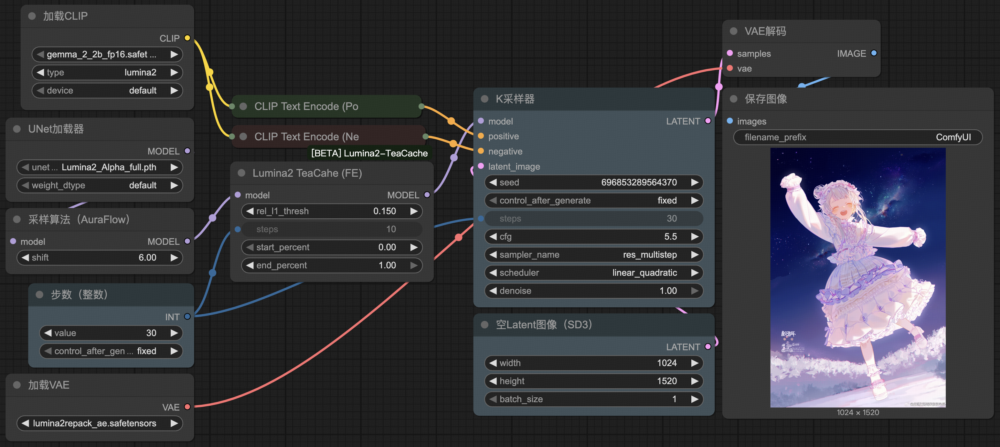

# Fe's TeaCache Lumina node for ComfyUI

## Installation

### Manual installation

```bash
// switch to your project's root directory
cd custom_nodes
git clone https://github.com/fexli/ComfyUI-Lumina2-TeaCache.git
```

### Installation via comfyui-manager

1. Open ComfyUI WebUI
2. Navigate to `Manager` -> `Install Custom Node`
3. Enter `ComfyUI-Lumina2-TeaCache` in the `Search` field, and click `Search`
4. Click `Install`

## Usage Instructions


1. Connect the `TeaCache` node between the `UNet Loader` and `KSampler` in your workflow.
2. Set the `rel_l1_thresh` parameter to a value greater than 0.

**Note:** 
- Higher `rel_l1_thresh` values will improve generation efficiency (manifested as shorter generation times), at the cost of reduced image quality.
- The optimal value should be determined through empirical testing based on your specific quality/efficiency requirements.

## Special Thanks

- ### [spawner](https://github.com/spawner1145)
  - [The original TeaCache implementation of Lumina2](https://github.com/spawner1145/TeaCache) in Diffusers
- ### [welltop-cn](https://github.com/welltop-cn/ComfyUI-TeaCache)
  - model patch code design

## Some awesome samplers

- [sd-samplers SMEA/DYN](https://github.com/spawner1145/sd-samplers)


Enjoy!
